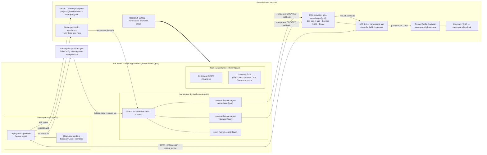
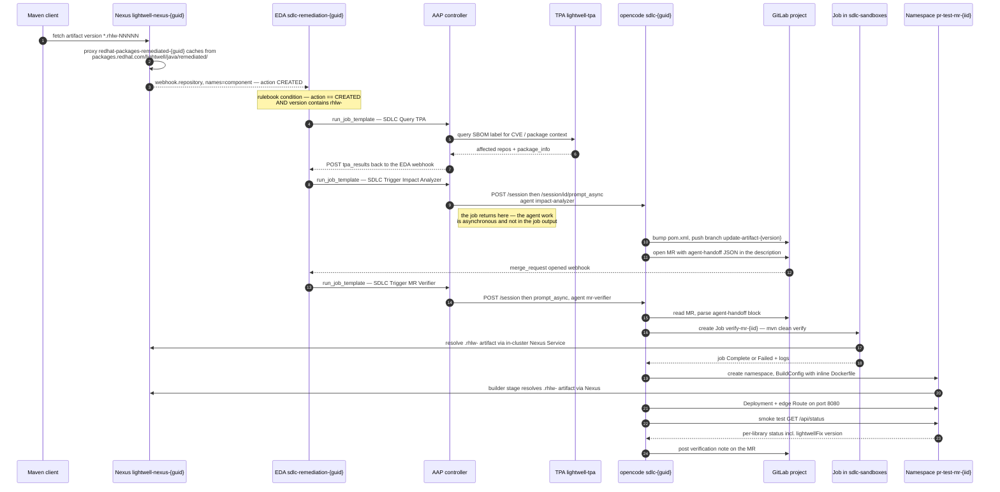
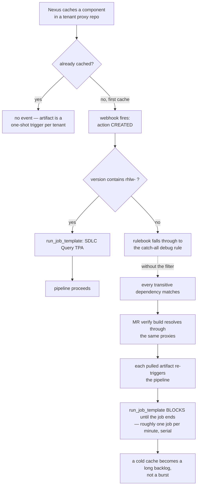

# Lightwell SDLC remediation — per-tenant architecture

How one tenant of the Lightwell demo is wired, and what happens end to end when a
remediated artifact lands in that tenant's Nexus.

Everything below is scoped to **a single tenant**, identified by its `{guid}`
(the validation run used `6bq2v-1`). Every tenant gets its own copy of the
per-tenant resources; the platform services are shared by all tenants on the
cluster.

---

## 1. Component view

One Argo CD `Application` — `lightwell-tenant-{guid}` in `openshift-gitops` —
renders the `bootstrap-tenant` Helm chart and owns everything in the left-hand
box. Everything in the right-hand box was installed once by `bootstrap-infra`
and is shared.

Note the **activation is per tenant but lives in the shared `aap` namespace**:
EDA runs each activation as a Kubernetes Job pod there, fronted by a Service on
port 5000 and a Route. The activation name carries the guid, so tenants do not
collide, but the namespace is not isolated.

The ephemeral namespace `pr-test-mr-{iid}` is also cluster-scoped, not inside
the tenant boundary — it is created on demand by the agent and torn down after
the demo.

---

## 2. Demo flow

The authentic path, from the artifact fetch to the verification note on the
merge request.

Steps worth understanding rather than just watching:

- **The AAP jobs are launchers, not the work.** `SDLC Trigger Impact Analyzer`
  and `SDLC Trigger MR Verifier` only create an opencode session and fire
  `prompt_async`. Their job output is a handful of tasks; none of the agent's
  reasoning, file edits, or `oc` calls appear there.
- **Two agents, deliberately disjoint.** `/app/opencode.json` defines
  `impact-analyzer` (the default) and `mr-verifier` as primary agents.
  `impact-analyzer` denies the `mr-verify-ephemeral` skill; `mr-verifier` denies
  `dependency-impact-remediation`. Neither can drift into the other's half of
  the pipeline.
- **The app repo ships no Dockerfile.** The ephemeral build passes a multi-stage
  Dockerfile inline via `--dockerfile`; the git source supplies only the code.
  Its builder stage points Maven at the tenant Nexus, otherwise the `.rhlw-`
  artifact cannot be resolved and the build looks like a bad bump when it is
  really a misconfigured build.

---

## 3. Why the `rhlw-` filter matters

Nexus fires `component CREATED` on the **first** cache of any component in a
proxy repo. That gives two useful properties and one trap.

Two consequences to plan the demo around:

1. **One shot per artifact per tenant.** Once the artifact is cached, refetching
   it produces no event. To re-run the demo, use a different `.rhlw-` version or
   reset the tenant's Nexus.
2. **EDA processes events serially.** `run_job_template` blocks until the AAP job
   completes, so events queue rather than run in parallel. Without the `rhlw-`
   filter, a cold cache produces a backlog that takes many minutes to drain.

---

## 4. Where to watch each stage

| Stage | Where to look |
| --- | --- |
| Artifact cached, webhook registered | Nexus console for `lightwell-nexus-{guid}` — proxy repos and browse/components |
| Event matched, job launched | AAP → Jobs list, and the EDA activation's log |
| TPA lookup | The `SDLC Query TPA` job output |
| **Agent reasoning and tool calls** | **The opencode web UI** at `https://opencode-ui-sdlc-{guid}.<apps-domain>` — the only place this is visible |
| Dependency bump | GitLab MR on branch `update-artifact-<version>`, `lightwell/lw-demo-help-app-{guid}` |
| Compile and unit test | Job `verify-mr-{iid}` in `sdlc-sandboxes` |
| Running remediated app | The edge Route in `pr-test-mr-{iid}`, path `/api/status` |
| Verdict | The verification note on the MR |

The opencode UI is served by the opencode server itself at `/` and is protected
by that server's own basic auth (user `opencode`). Sessions are stored under
`HOME=/tmp`, which is an `emptyDir` — **transcripts do not survive a pod
restart**, so avoid rolling the `opencode` Deployment mid-demo.

---

## 5. Per-tenant resource reference

| Resource | Name |
| --- | --- |
| Argo CD Application | `lightwell-tenant-{guid}` (in `openshift-gitops`) |
| OpenCode control plane namespace | `sdlc-{guid}` |
| Nexus namespace | `lightwell-nexus-{guid}` |
| Bootstrap jobs / config namespace | `lightwell-tenant-{guid}` |
| Nexus proxy — validated | `redhat-packages-validated-{guid}` → `https://packages.redhat.com/lightwell/java/validated/` |
| Nexus proxy — remediated | `redhat-packages-remediated-{guid}` → `https://packages.redhat.com/lightwell/java/remediated/` |
| Nexus proxy — Maven Central | `maven-central-{guid}` |
| EDA activation | `sdlc-remediation-{guid}` (Job pod in `aap`, Service `:5000`, Route) |
| GitLab project | `lightwell/lw-demo-help-app-{guid}` |
| OpenCode Service | `opencode.sdlc-{guid}.svc:4096` |
| OpenCode UI Route | `opencode-ui-sdlc-{guid}.<apps-domain>` |
| AAP organization | `user-{guid}` |

AAP job templates, in execution order: `SDLC Query TPA` →
`SDLC Trigger Impact Analyzer` → `SDLC Trigger MR Verifier`.

AAP 2.5 fronts the controller behind its gateway, so controller API calls use
the `/api/controller/v2/...` path rather than the pre-2.5 `/api/v2/...`.
