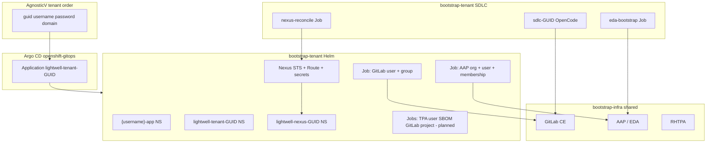

# Tenant provisioning plan — Lightwell lab

This document is the **elaborate plan** for per-tenant bootstrap after **`bootstrap-infra`** is healthy on a shared cluster. It aligns with AgnosticV tenant CI, Argo CD, and **`bootstrap-tenant`** (including OpenCode, EDA, and Nexus webhooks).

**Prerequisites:** Cluster chart synced ([`bootstrap-infra/README.md`](bootstrap-infra/README.md)) — GitLab, AAP+EDA, RHTPA, Quay, OpenShift GitOps. **Not** shared Nexus (moved to tenant).

---

## 1. Goals

| Goal | Meaning |
|------|---------|
| **Isolation** | Each lab order (`guid`) gets own Nexus, own AAP org scope, own GitLab identity, own OCP namespaces — no cross-tenant `edit` on others’ resources. |
| **Repeatability** | Same Helm chart + AgnosticV `helm_values`; Argo sync per tenant. |
| **Demo-ready** | After tenant + SDLC layers, that user can run Nexus → EDA → TPA → OpenCode → GitLab MR for **their** repos. |
| **GitOps** | Tenant lifecycle = Argo `Application` (or ApplicationSet), not manual `oc` except break-glass. |

---

## 2. Architecture (per tenant)



**Traffic for demo loop (one tenant):**

```text
Nexus (tenant) → EDA (tenant activation) → TPA (shared) → OpenCode (tenant or shared NS) → GitLab (tenant project)
GitLab MR webhook → EDA → OpenCode mr-verifier
```

---

## 3. AgnosticV contract (tenant CI)

Tony’s pattern — tenant GitOps bootstrap points at **workshop**, not `lightwell-automation-gitops`:

```yaml
ocp4_workload_gitops_bootstrap_repo_url: https://github.com/rhpds/lightwell-workshop.git
ocp4_workload_gitops_bootstrap_repo_path: automation/gitops/bootstrap-tenant
ocp4_workload_gitops_bootstrap_repo_revision: main   # or demo-update / env branch
ocp4_workload_gitops_bootstrap_application_name: "lightwell-tenant-{{ guid }}"
ocp4_workload_gitops_bootstrap_helm_values:
  guid: "{{ guid }}"
  username: "user-{{ guid }}"
  password: "{{ common_password }}"
  deployer:
    domain: "{{ openshift_cluster_ingress_domain }}"
    storageClass: "<cluster-sc>"   # add if not defaulted in chart
  aap:
    namespace: aap
    org: "user-{{ guid }}"
  gitlab:
    namespace: gitlab
    domain: "{{ openshift_cluster_ingress_domain }}"
    group: lightwell
  nexus:
    lightwellNetwork:
      username: "<from vault or lab secret>"
      password: "<from vault>"
```

**OpenShift login:** Tenant CI also creates Keycloak/htpasswd user `user-{{ guid }}` (AgnosticV / Showroom) — must match `username` in chart for `RoleBinding` subjects.

---

## 4. Argo CD delivery model

### Option A — One Application per tenant (lab / RHDP default)

- Name: `lightwell-tenant-<guid>`
- Namespace: `openshift-gitops`
- Source: same repo/path, **different helm values** per order
- Example: [`argocd-application-bootstrap-tenant.yaml.example`](argocd-application-bootstrap-tenant.yaml.example)

**Pros:** Simple, matches AgnosticV one-app-per-order.  
**Cons:** N applications to manage; values often generated by Ansible at order time.

### Option B — ApplicationSet (later)

- Generator: cluster labels, Sandbox API, or git file with tenant list
- Template: same chart, parameters from generator

**Use when:** many concurrent tenants and you want one manifest.

### Sync policy (recommended)

```yaml
syncPolicy:
  automated:
    prune: true      # tenant delete removes tenant resources (careful in shared labs)
    selfHeal: true
  syncOptions:
    - CreateNamespace=true
```

For **dvb52 manual tests**, use `prune: false` until stable.

---

## 5. `bootstrap-tenant` chart — layers and status

### 5.1 Implemented today (chart v0.3.0)

| Resource | Purpose |
|----------|---------|
| `{{ username }}-app` namespace | Learner app sandbox (`edit` RoleBinding) |
| `lightwell-tenant-{{ guid }}` | Bootstrap Job namespace + `lightwell-tenant-jobs` SA |
| `lightwell-nexus-{{ guid }}` | Dedicated Nexus instance |
| Nexus STS, PVC, Route, admin + Lightwell Network secrets | Artifact ingress for **this** tenant |
| `nexus-reconcile` Job | Maven repos + EDA webhooks (when `sdlc.edaWebhookUrl` set) |
| GitLab / AAP create Jobs + cross-ns RBAC | User, group, project, org `user-{{ guid }}`, membership (best-effort) |
| `seed-tpa-uploader` Job | Keycloak uploader + demo CycloneDX SBOM with `TPA_SBOM_LABEL` |
| `eda-bootstrap` Job | EDA project, decision env, activation `sdlc-remediation-{{ guid }}` |
| `ClusterRoleBinding` `anyuid-nexus-{{ guid }}` | Nexus pod SCC |
| `RoleBinding` `{{ username }}-nexus-edit` | Tenant OCP user can manage **only** their Nexus NS |

### 5.2 Deferred / optional

| Template | Purpose | Priority |
|----------|---------|----------|
| `templates/aap/job-delete.yaml` | Teardown on tenant delete | P2 |
| `templates/gitlab/job-delete.yaml` | Teardown | P2 |
| Nexus local read-only users | Learner Maven creds without admin | P2 |
| ~~Artifactory tenant jobs~~ | **Skip** — not in SDLC demo path | — |

### 5.3 In-chart SDLC (v0.4+)

| Template | Purpose |
|----------|---------|
| `templates/sdlc/*` | Namespace `sdlc-<guid>`, OpenCode Deployment/Service, secrets |
| `templates/eda/*` | EDA project + activation bootstrap |
| `templates/nexus/reconcile-job.yaml` | Nexus webhook capabilities + repo hooks |
| `tenant/integration-configmap.yaml` | Per-tenant URLs (replaces external `cluster-config` overlays) |

### 5.4 Sync waves (target)

| Wave | Resources |
|------|-----------|
| -2 | `{{ username }}-app` NS, `lightwell-tenant-{{ guid }}` NS, `lightwell-nexus-{{ guid }}` NS |
| -1 | SAs, RBAC, Nexus secrets |
| 0 | GitLab + AAP bootstrap Jobs (need cross-ns RBAC) |
| 1 | Nexus STS |
| 2 | Nexus Route, seed Jobs (TPA, GitLab project) |
| 2–3 | `sdlc-<guid>` NS, OpenCode, secrets |
| 4 | `eda-bootstrap`, `nexus-reconcile` Jobs |

---

## 6. RBAC model (elaborate)

### 6.1 OpenShift

| Subject | Scope | Role |
|---------|--------|------|
| `User/user-{{ guid }}` | `{{ username }}-app` | `edit` (existing) |
| `User/user-{{ guid }}` | `lightwell-nexus-{{ guid }}` | `edit` (existing) |
| `User/user-{{ guid }}` | `lightwell-tenant-{{ guid }}` | `view` or `edit` (for Job logs) — **add** |
| `User/user-{{ guid }}` | `gitlab`, `aap`, `lightwell-tpa` | **no access** (or `view` routes only if you want console tour) |
| `ServiceAccount/lightwell-tenant-jobs` | `gitlab`, `aap` secrets (root token, admin) | narrow Role — port from prior art |

### 6.2 GitLab

| Identity | Access |
|----------|--------|
| `user-{{ guid }}` | Member of group `lightwell`, **Maintainer** on own project |
| Root token (Job only) | Creates users; not given to learner |

### 6.3 Nexus

| Identity | Access |
|----------|--------|
| `admin` (secret) | Used by **automation Jobs** for repos + webhook capabilities |
| Optional Nexus local user per tenant | **read/browse + deploy** only on `redhat-packages-*-{{ guid }}` repos — **P1** |
| Learner | Maven via repo URL + creds; **does not** create webhooks (platform Job does) |

### 6.4 AAP / EDA

| Identity | Access |
|----------|--------|
| `user-{{ guid }}` | Organization **`user-{{ guid }}`** only |
| EDA project/activation | `organization_id` = that org; unique activation name e.g. `sdlc-remediation-{{ guid }}` |
| Webhook URL | Per activation (EDA service/route) — stored in tenant `cluster-config` |

### 6.5 TPA

| Identity | Access |
|----------|--------|
| Shared TPA UI | All tenants (read-only lab) |
| Automation uploader user | Per-tenant or per-app SBOM label — **must not** read other tenants’ SBOM labels in playbooks (`tpa_sbom_label` in EDA `extra_var`) |

---

## 7. SDLC layer per tenant (`bootstrap-tenant`)

All SDLC workloads ship in **one** Argo Application per guid (`automation/gitops/bootstrap-tenant`). SCM content (rulebooks/playbooks) lives in [`lw-sdlc-opencode`](../../../lw-sdlc-opencode).

### 7.1 Namespace

Default OpenCode namespace: **`sdlc-<guid>`**. For clusters that still run a legacy shared `sdlc-control-plane` NS, set `sdlc.namespace: sdlc-control-plane` in Helm values until migrated.

### 7.2 Secrets (chart-managed)

| Secret | Source |
|--------|--------|
| `opencode-server` | `sdlc.opencodeServerPassword` or tenant `password` |
| `gitlab-credentials` | Tenant `username` / `password`; optional `gitlab.pat` |
| `opencode-llm` | Optional `sdlc.llm.apiKey` |

Nexus admin and Lightwell Network credentials remain in the Nexus subchart secrets.

### 7.3 Ordering

```text
1. bootstrap-tenant synced (Nexus route, GitLab user, AAP org)
2. OpenCode pod ready in sdlc-<guid>
3. eda-bootstrap Job → EDA activation + Controller JTs
4. nexus-reconcile Job → webhooks (uses EDA_WEBHOOK_URL from tenant-integration)
5. GitLab project webhook → EDA route (manual or playbook)
6. verify-sdlc-flow.sh <guid> [--smoke]
```

---

## 8. Implementation phases (engineering)

### Phase T0 — AgnosticV + Argo wiring (skipped for now)

- [ ] Tenant CI uses `bootstrap-tenant` path on workshop fork/branch
- [ ] Document `storageClass` + Lightwell Network creds in helm_values
- [ ] Push `demo-update` (or merge to `main`) so Argo resolves revision

### Phase T1 — Chart completeness (workshop)

- [x] Port `lightwell-tenant-{{ guid }}` NS + `lightwell-tenant-jobs` SA
- [x] Port GitLab create Job + RBAC
- [x] Port AAP create Job + org membership (gateway API)
- [x] Drop Artifactory templates from values/docs

### Phase T2 — Seed data Jobs

- [x] TPA uploader + demo SBOM per tenant
- [x] GitLab demo project per tenant
- [x] Document `REMEDIATION_APP_GITLAB_PATH` convention (`tenant-integration` ConfigMap)

### Phase T3 — Nexus repos + webhooks

- [x] Repo names suffixed with `{{ guid }}` in chart ConfigMap
- [x] `nexus-reconcile` Job in tenant chart
- [x] Webhook URL from `sdlc.edaWebhookUrl` (set after activation if needed)

### Phase T4 — EDA + OpenCode per tenant

- [x] `bootstrap-aap-eda.py` uses `EDA_ORGANIZATION_NAME` + per-tenant activation name
- [x] In-chart `eda-bootstrap` Job
- [x] SDLC (OpenCode + EDA + Nexus webhooks) in `bootstrap-tenant` chart

### Phase T5 — Hardening

- [ ] Nexus local users + privileges (optional)
- [ ] ApplicationSet for tenants
- [ ] Teardown Jobs on tenant delete
- [x] `verify-bootstrap-tenant.sh` + `LIGHTWELL_RESET_GUID` in reset script

---

## 9. Acceptance criteria (one tenant)

Run after tenant order on a cluster with healthy `bootstrap-infra`:

| # | Check | Command / signal |
|---|--------|------------------|
| 1 | Tenant Argo app **Synced** | Argo UI / `oc get application lightwell-tenant-<guid> -n openshift-gitops` |
| 2 | Nexus pod **Running** | `oc get pods -n lightwell-nexus-<guid>` |
| 3 | Nexus route | `curl -sk -o /dev/null -w '%{http_code}' https://$(oc get route nexus -n lightwell-nexus-<guid> -o jsonpath='{.spec.host}')/` → 200 |
| 4 | GitLab login | `user-<guid>` / password at `gitlab-gitlab.<domain>` |
| 5 | AAP login | Same user sees **only** org `user-<guid>` |
| 6 | OCP RBAC | `oc login` as user → `can-i update pods -n lightwell-nexus-<guid>` yes; `-n gitlab` no |
| 7 | EDA activation **running** | AAP UI → EDA → `sdlc-remediation-<guid>` (or agreed name) |
| 8 | Nexus webhooks | 2 capabilities on tenant repos → tenant EDA URL |
| 9 | TPA query | `query-tpa.yml` with tenant `tpa_sbom_label` returns SBOM |
| 10 | OpenCode | Pod ready; trigger sample `tpa_results` → MR on tenant project |

---

## 10. Manual test on dvb52 (before AgnosticV)

```bash
GUID=dvb52-1
USER=user-dvb52-1
PASS='...'
DOMAIN=apps.cluster-dvb52.dyn.redhatworkshops.io
SC=ocs-external-storagecluster-ceph-rbd-immediate

helm template "tenant-${GUID}" automation/gitops/bootstrap-tenant/ \
  --set guid="$GUID" --set username="$USER" --set password="$PASS" \
  --set deployer.domain="$DOMAIN" --set deployer.storageClass="$SC" \
  | oc apply -f -

# Or kubectl apply -f argocd-application-bootstrap-tenant.yaml (after editing GUID/PASS)
```

Then run SDLC gitops with `NEXUS_NAMESPACE=lightwell-nexus-${GUID}` and URLs from routes.

**Reset one tenant:**

```bash
LIGHTWELL_RESET_GUID=dvb52-1 ./automation/gitops/bootstrap-infra/scripts/reset-lightwell-platform.sh
./automation/gitops/bootstrap-tenant/scripts/verify-bootstrap-tenant.sh dvb52-1
```

---

## 11. What tenant provisioning is **not**

- **Not** reinstalling GitLab / AAP / TPA (cluster chart)
- **Not** shared Nexus (removed from infra)
- **Not** Artifactory/Jenkins per tenant for current demo
- **Not** full multi-tenant OpenCode hard isolation (unless you choose Phase T4 namespace-per-tenant)

---

## 12. Related files

| Path | Role |
|------|------|
| [`bootstrap-tenant/README.md`](bootstrap-tenant/README.md) | Chart quick reference |
| [`bootstrap-tenant/values.yaml`](bootstrap-tenant/values.yaml) | Default values |
| [`argocd-application-bootstrap-tenant.yaml.example`](argocd-application-bootstrap-tenant.yaml.example) | Argo Application template |
| [`../EXECUTION-PLAN.md`](../../../EXECUTION-PLAN.md) | End-to-end demo phases (workspace) |
| [`../../../ADR.md`](../../../ADR.md) | ADR-006, ADR-008 (workshop vs automation-gitops, Nexus per tenant) |
