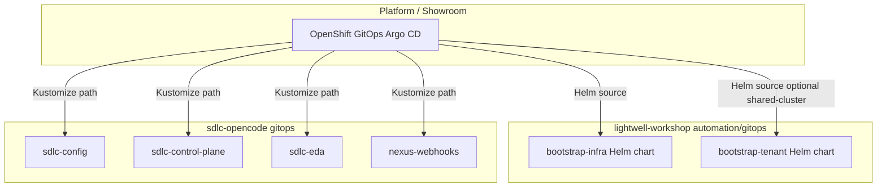

# Argo CD integration — `lightwell-workshop` + `sdlc-opencode`

This document reviews **how the workshop provisions GitOps today** and how **this repository** (`sdlc-opencode` / `lw-demo-test-agents`) should plug into the same Argo CD instance.

## What `lightwell-workshop` actually contains

Path: `automation/gitops/` in [lightwell-workshop](https://github.com/rhpds/lightwell-workshop) (local: `/Users/sshaaf/git/demos/lightwell-workshop`).

| Chart | Purpose | Resources |
|-------|---------|-----------|
| **`bootstrap-infra`** | Shared cluster smoke / infra hook | Namespace `gitops-test` (Argo sync-wave **-2**) |
| **`bootstrap-tenant`** | Shared-cluster topology only (`--topology shared-cluster`) | Namespace `{{ username }}-app`, RoleBinding `edit` for lab user (waves **-2** / **-1**) |

There are **no `Application` CRs** in the workshop repo. RHDP / AgnosticD / Showroom **registers** Argo CD Applications that point at these Helm charts (see `publishing-house/spec/design.md` — automation approach **GitOps (Helm + ArgoCD)**). Values today are minimal (`deployer.domain`, `username`).



**Takeaway:** Workshop bootstrap = **tenant/lab scaffolding**. SDLC demo = **separate Applications** from **this git repo**; they complement each other, not replace platform stack (AAP, TPA, Nexus, GitLab).

## Responsibility split

| Layer | Repo | Argo source type | Delivers |
|-------|------|------------------|----------|
| Lab / workshop bootstrap | `lightwell-workshop` | Helm (`bootstrap-infra`, `bootstrap-tenant`) | `gitops-test`, optional `{user}-app` + RBAC |
| SDLC remediation demo | `sdlc-opencode` | Kustomize under `gitops/*` | `sdlc-control-plane`, EDA bootstrap Job, Nexus reconcile, cluster config |
| Platform stack | Ops / AgD (not in workshop git) | Various | AAP, EDA operator, RHTPA, GitLab, Nexus, Quay, etc. |

## Sync waves (avoid fighting bootstrap)

Workshop templates use **negative** waves for namespaces/RBAC:

| Wave | Workshop | SDLC (`sdlc-opencode`) |
|------|----------|-------------------------|
| -2 | `gitops-test`, `{user}-app` namespaces | — |
| -1 | Tenant RoleBinding | **`sdlc-config`** Application (ConfigMap) |
| 0 | — | **`sdlc-eda`** bootstrap Job |
| 1 | — | **`nexus-webhooks`** Job |

Use a **dedicated namespace** `sdlc-control-plane` for the demo (already in our manifests). Do not reuse `gitops-test` or `{username}-app` for OpenCode/EDA Jobs unless you intentionally collapse environments.

## How to register SDLC apps on a workshop cluster

### Option A — Apply from this repo (quickest)

After workshop infra and platform services are up:

1. Fill [`gitops/base/cluster-config/cluster-config.yaml`](../../gitops/base/cluster-config/cluster-config.yaml).
2. Create secrets in `sdlc-control-plane` ([`gitops/secrets/README.md`](../../gitops/secrets/README.md)).
3. Register `sdlc-opencode` in Argo if private.
4. Apply Applications:

   ```bash
   kubectl apply -f gitops/argocd/applications/
   ```

5. Sync in order per [`gitops/PROVISION.md`](../../gitops/PROVISION.md).

Argo CD namespace is **`openshift-gitops`** in our manifests; change `metadata.namespace` on each Application if your cluster uses another Argo namespace.

### Option B — App-of-apps from workshop (recommended for RHDP)

Add an Application in **`lightwell-workshop`** (or a platform config repo) that points at **this** repository:

Example manifest lives in this repo as [`gitops/integration/lightwell-workshop/sdlc-opencode-app-of-apps.yaml`](../../gitops/integration/lightwell-workshop/sdlc-opencode-app-of-apps.yaml).

Platform operators:

1. Copy or reference that file from the workshop automation repo.
2. Set `spec.source.repoURL` / `targetRevision` to the fork used in the lab.
3. Let one parent Application sync all child `sdlc-*` apps.

### Option C — Helm wrapper in workshop (same pattern as bootstrap-infra)

Add `automation/gitops/sdlc-opencode/` as a thin Helm chart whose templates only emit `Application` CRs (values: `repoURL`, `revision`, `argocdNamespace`). Keeps all lab GitOps entry points under `lightwell-workshop/automation/gitops/`.

## Repo URL and SCM alignment

| Consumer | URL to configure |
|----------|------------------|
| Argo CD Applications | `gitops/argocd/applications/*.yaml` → `spec.source.repoURL` |
| AAP EDA project (`EDA_PROJECT_SCM_URL`) | Same repo **root** (must contain `eda-rulebooks/` + `playbooks/`) |

If the workshop only mirrors **lightwell-workshop** to GitLab, mirror **sdlc-opencode** separately (or add it as a submodule / second Application). EDA cannot use the workshop repo alone—it does not contain rulebooks.

## Checklist after workshop provision

- [ ] Argo CD healthy; bootstrap-infra (and tenant chart if used) synced
- [ ] Platform URLs collected → `sdlc-cluster-config`
- [ ] Secrets in `sdlc-control-plane`
- [ ] SDLC Applications synced; `sdlc-eda` activation **running**
- [ ] `nexus-webhooks` Job succeeded
- [ ] OpenCode pod running; GitLab + Nexus webhooks aimed at EDA route
- [ ] Demo flow per [README](../../README.md#demo-flow-nexus-webhook-onwards)

## Gaps / follow-ups for workshop repo

The workshop scaffold does **not** yet ship:

- Application manifests for the SDLC demo (add via Option B or C above).
- Shared `AppProject` for lab workloads (still `default` in our samples).
- Wiring `bootstrap-infra` values to real `deployer.domain` (still `apps.example.com` placeholder).

Those are intentional extension points for the publishing-house automation agent or platform team—not blockers for manual SDLC install (Option A).
